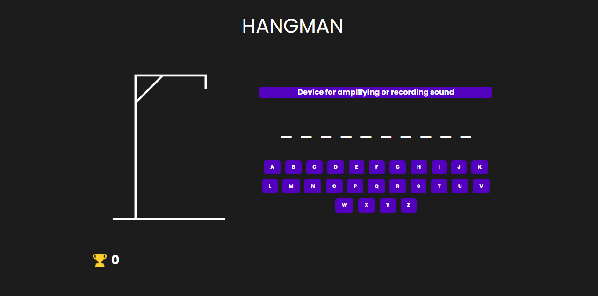

# HangmanReact




<p>O projeto "Hangman" é uma recriação do clássico jogo da forca. Nele, o jogador precisa adivinhar palavras antes que todas as tentativas se esgotem, utilizando um teclado fornecido no jogo.</p>

## 💻 Pré-requisitos

Antes de começar, verifique se você atendeu aos seguintes requisitos:

- Fazer a instalação do `<NodeJS versão 20.9.0>`
- Fazer instalação de um `<editor de código>`, estamos utilizando o Visual Studio Code
- Fazer instalação do `<Git`> para clonar nosso repositório
- Você tem uma máquina `<Windows>`.

## 🚀 Instalando HangmanReact

Para instalar o HangmanReact, siga estas etapas:

Primeiro de clone o nosso projeto com o comando:
```
git clone https://github.com/BiellSouza2005/HangmanReact.git
```
Entre na pasta do projeto e escreva os seguintes comandos no terminal:
```
cd FrontEnd
cd hangman
```
Instale as dependências do projeto com o comando:
```
npm install
```
## ☕ Usando HangmanReact

Após ter instalado todas as dependências, execute o projeto com:
```
npm run dev
```
Depois desse comando, entre no link gerado

## 🤝 Colaboradores

Agradecemos às seguintes pessoas que contribuíram para este projeto:

<table>
  <tr>
    <td align="center">
      <a href="https://github.com/andersonTengan" title="GitHub do Anderson Tengan">
        <br>
        <sub>
          <b>Anderson Tengan</b>
        </sub>
      </a>
    </td>
    <td align="center">
      <a href="https://github.com/siq-andre" title="GitHub do André Siqueira">
        <br>
        <sub>
          <b>André Siqueira</b>
        </sub>
      </a>
    </td>
    <td align="center">
      <a href="https://github.com/carolinayatabe" title="GitHub da Carolina Yatabe">
        <br>
        <sub>
          <b>Carolina Yatabe</b>
        </sub>
      </a>
    </td>
    <td align="center">
      <a href="https://github.com/biellSouza2005" title="GitHub do Gabriel Souza">
        <br>
        <sub>
          <b>Gabriel Souza</b>
        </sub>
      </a>
    </td>
    <td align="center">
      <a href="https://github.com/massayukiotaki" title="GitHub do Gabriel Massayuki">
        <br>
        <sub>
          <b>Gabriel Massayuki</b>
        </sub>
      </a>
    </td>
    <td align="center">
      <a href="https://github.com/iangodinho" title="GitHub do Ian Godinho">
        <br>
        <sub>
          <b>Ian Godinho</b>
        </sub>
      </a>
    </td>
    <td align="center">
      <a href="https://github.com/KMNagayama" title="GitHub do Kawan Nagayama">
        <br>
        <sub>
          <b>Kawan Nagayama</b>
        </sub>
      </a>
    </td>
    <td align="center">
      <a href="https://github.com/sc4zuki" title="GitHub do Kevin Suzuki">
        <br>
        <sub>
          <b>Kevin Suzuki</b>
        </sub>
      </a>
    </td>
  </tr>
</table>


